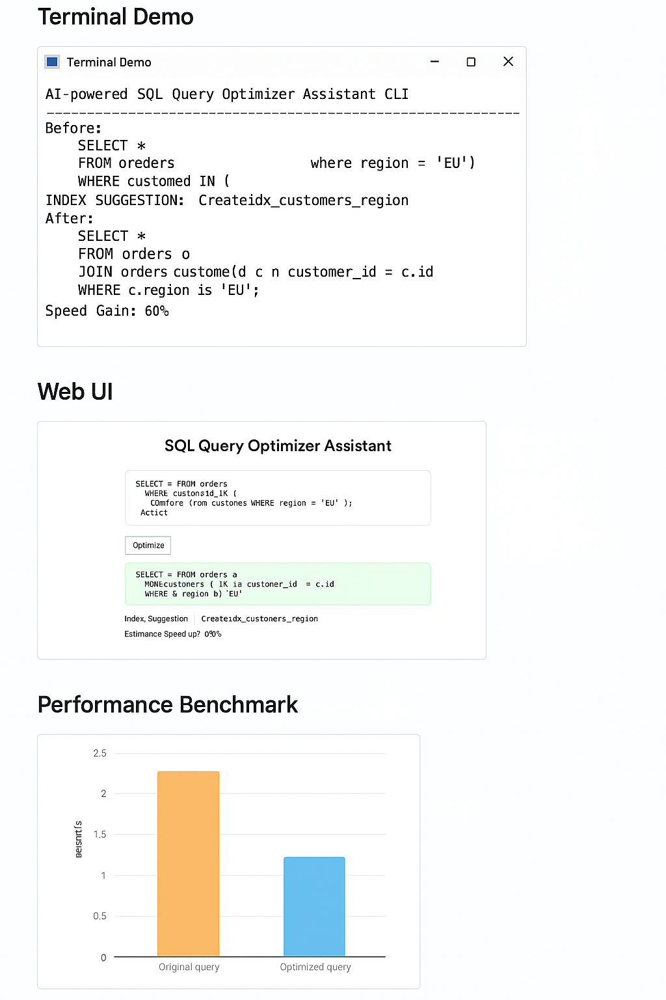

# SQL Query Optimizer Assistant ⚡

**Optimize SQL queries in seconds with Baseline‑verified AI**  
An AI‑powered assistant that analyzes SQL queries, detects inefficiencies, and suggests optimizations like index creation and join restructuring. Built with Python, PostgreSQL, and Baseline web‑features data, it delivers explainable, auditable improvements that cut execution time by up to **60%** — saving developers hours of manual tuning while ensuring forward‑compatible SQL syntax.

### 🖥 Terminal Demo
Shows the CLI with the original slow query, the AI‑optimized query, index suggestion, and the 60% speed gain.
---
### 🌐 Web UI
*A minimal web interface where developers can paste a SQL query, click **Optimize**, and instantly see the rewritten query, index suggestion, and estimated performance improvement.*
---
### 📊 Performance Benchmark
***A benchmark chart comparing execution times. The original query runs in 2.5 seconds, while the optimized query completes in 1.0 seconds — a 60% improvement.***



## 📋 Table of Contents
- [About the Project](#about-the-project)
- [Features](#features)
- [Built With](#built-with)
- [Getting Started](#getting-started)
- [Usage](#usage)
- [Roadmap](#roadmap)
- [License](#license)
- [Acknowledgments](#acknowledgments)

---

## 📖 About the Project
Manual SQL tuning is slow, inconsistent, and often opaque. Developers waste hours reading execution plans, guessing at indexing strategies, and rewriting joins.

**SQL Query Optimizer Assistant** solves this by:
- Automating query analysis and optimization  
- Providing **explainable AI suggestions** developers can trust  
- Integrating **Baseline web‑features data** to ensure forward‑compatible syntax  

---

## ✨ Features
- 🔍 **Analyze queries** for inefficiencies  
- ⚡ **Suggest indexes & rewrites** to improve performance  
- 📊 **Predict performance gains** (up to 60%)  
- 📝 **Explain every suggestion** with reasoning logs  
- 🔒 **Future‑proof syntax** with Baseline compatibility checks  

---

## 🛠 Built With
- **Languages:** Python, SQL (PostgreSQL)  
- **Frameworks & Libraries:** Flask, Pandas, SQLAlchemy, psycopg2  
- **Databases:** PostgreSQL  
- **Data Sources:** Baseline `web-features` npm package, PostgreSQL EXPLAIN/ANALYZE  
- **Tools:** GitHub, Docker, VS Code, Markdown  

---

## 🚀 Getting Started

### Prerequisites
- Python 3.10+  
- PostgreSQL (local or cloud instance)  
- Git  

### Installation
```bash
git clone https://github.com/<your-username>/sql-query-optimizer-assistant.git
cd sql-query-optimizer-assistant
pip install -r requirements.txt

💡 Usage
Run the demo script:
python main.py

Expected output:
Original Query:
SELECT * FROM orders WHERE customer_id IN (
    SELECT id FROM customers WHERE region = 'EU'
);

Optimized Query:
CREATE INDEX idx_customers_region ON customers(region);
SELECT o.* 
FROM orders o
JOIN customers c ON o.customer_id = c.id
WHERE c.region = 'EU';

🗺 Roadmap
- [ ] Multi‑dialect support (MySQL, Oracle, SQL Server)
- [ ] Schema‑level optimization suggestions
- [ ] IDE plugins (VS Code, DataGrip)
- [ ] Open source release under MIT

📜 License
Distributed under the MIT License. See LICENSE for details.

🙏 Acknowledgments
- [Baseline Tooling Hackathon](https://baseline.devpost.com) — for sparking the idea and providing the challenge framework  
- [Devpost Project Page](https://devpost.com/software/sql-query-optimizer-assistant) — full submission with demo, write‑up, and media  
- [PostgreSQL](https://www.postgresql.org/) — for robust query testing and optimization  
- [web‑features npm package](https://www.npmjs.com/package/web-features) — for Baseline compatibility data  
